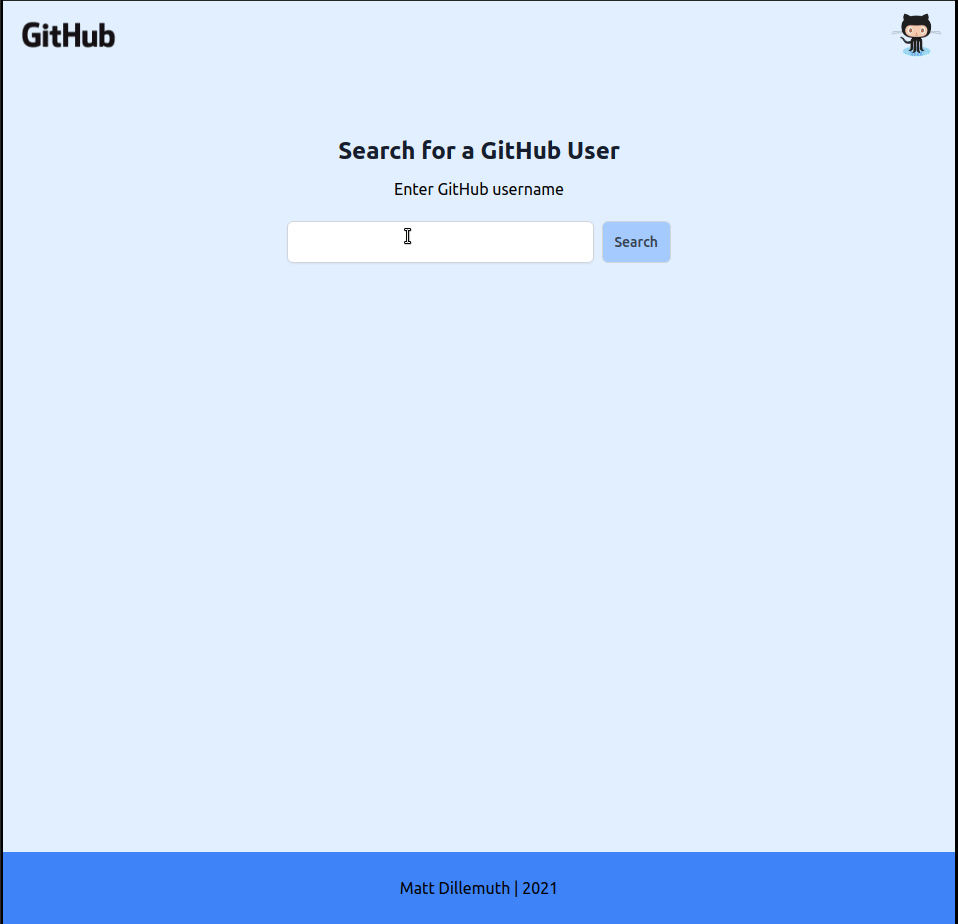

# my-github-app

A simple app using the public GitHub API to show information to the person using it

### Tools Used

- Parcel
- npm
  - axios
- GitHub Public API
- Browser-Sync

### Credits / Thanks

@flaviocopes
